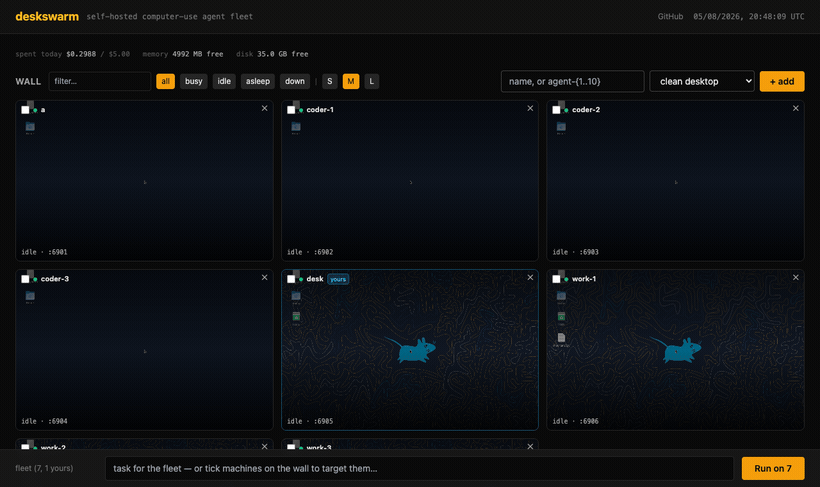

# deskswarm

[](LICENSE)
[](docker-compose.yml)
[](https://github.com/trycua/cua)
[](https://github.com/ahmedvnabil/deskswarm/actions/workflows/ci.yml)
[](https://github.com/trycua/cua/issues/2869)

**Self-hosted Linux desktops in your browser. Spin one up in a second, work
in it, share it with one person, hand one to an AI agent over MCP — or all
four.**

deskswarm runs full XFCE desktops in Docker and gives you one dashboard to
manage them: a wall of live screens, files in and out, copy-paste that works,
sleep the ones you're not using, back them up, and share a single machine with
someone without giving them the rest.

Every machine also has **its own MCP endpoint**. Issue a key, point Claude
Code (or any MCP client) at it, and that client gets the machine's screen,
keyboard, root shell and home directory — one machine per key, revocable, and
every call it makes shows up on the wall while it works.

deskswarm brings the computer; your client brings the model. There is no API
key to give deskswarm, because it never calls one.

<p align="center">
  
</p>

<p align="center">
  <sub>Real recording: add a machine, browse its files, share it with one
  person, sleep it, wake it.</sub>
</p>

## Run it

Docker and Docker Compose. Nothing else, no configuration:

```bash
git clone https://github.com/ahmedvnabil/deskswarm.git
cd deskswarm
docker compose up -d --build
```

Open **http://localhost:7861**, type a name, hit **+ add**. That's a real
Linux desktop, in your browser, about a second later. (The first one also
builds the agent bridge, so give that one a minute.)

Opening the dashboard from another device on your network works too — screen
links follow whatever hostname you used, so `http://192.168.1.50:7861` needs
no extra setting.

There's a `Makefile` if you prefer: `make up`, `make logs`, `make check`,
`make backup`, `make doctor`.

### On a Mac, as an app

`./mac/build-app.sh` builds **DeskSwarm.app** next to this README — a normal
double-clickable Mac app with a Dock icon. It starts your Docker runtime
(OrbStack or Docker Desktop) if it isn't running, brings the stack up, waits
for `/health`, then opens the dashboard in its own window with no browser
chrome and no Terminal. Drag it to the Dock and that's the whole workflow.

It builds the image on first launch and after you edit anything under
`dashboard-ts/`; otherwise it reattaches to the running container instead of
restarting it. If port 7861 is taken by something else it moves to the next
free one. Machines still run as Linux containers under your Docker runtime —
the app is the control panel, not the swarm.

Two `.command` files sit alongside it: **Start DeskSwarm** does the same thing
in a visible Terminal that follows the log (use it when a launch fails), and
**Stop DeskSwarm** runs `docker compose down`. Launch problems are logged to
`~/Library/Logs/DeskSwarm/launch.log`.

The bundle hardcodes this checkout's path, so rerun `./mac/build-app.sh` after
moving or recloning the project.

**Keep the project out of `~/Downloads`, `~/Desktop` and `~/Documents`.** macOS
gives an app launched from Finder no read access to those folders, and the
failure is silent: `open` reports success and nothing runs — no window, no
error, no log line. `~/Developer` is fine. `build-app.sh` refuses to build in a
protected folder rather than hand you an app that quietly does nothing. The
`.command` files work anywhere, since a Terminal passes its own permissions
down to them.

### If something doesn't work

| symptom | cause | fix |
|---|---|---|
| machines never start, Docker logs mention AppArmor | Docker nested in a Proxmox/LXC container | `DESKSWARM_DISABLE_APPARMOR=1` in `.env`, and `lxc.apparmor.profile: unconfined` on the container |
| tiles show "bridge down" for a minute after the first add | the bridge image is still building | wait, then use **restart** on the tile |
| screens are black from another device | a reverse proxy rewrote the host | set `DESKSWARM_PUBLIC_HOST` to the address the browser uses |
| "not enough memory" but the host looks free | the dashboard is under an LXC/VM memory cap it can't see | set `DESKSWARM_MEMORY_BUDGET_MB` to the real budget |

`make doctor` checks all of these.

## Features

- **Manage the fleet from the UI** — add a computer by typing a name, and
  deskswarm creates its desktop + agent-bridge containers on the fly.
  Rename it, remove it, or grow to dozens of machines without touching
  `docker-compose.yml`. Each one is an independent machine with its own
  agent, its own screen, and its own installed software.
- **Add a batch at once** — `agent-{1..10}` in the name field creates ten
  machines in one go (zero-padding like `node-{01..10}` is preserved). Names
  that clash are reported individually; the rest still get created.
- **Snapshots** — provision one machine the way you like, hit **snapshot**,
  and every machine you create from it starts with that software already
  installed. No re-running setup on each new machine.
- **Per-machine terminal** — shell into any computer straight from the
  dashboard (runs as root), so you can `apt-get install` whatever that
  machine needs for its job.
- **Software inventory** — one click shows a machine's OS, kernel, runtimes
  (Python/Node/Go/…), installed apps, package count, and disk/RAM.
- **A wall of live screens** — the fleet is shown as its actual screens, not
  a list. You see what is happening in every machine at a glance; one an
  outside client is working in is outlined amber and captioned with the last
  tool it called, a broken one is red. Tiles poll a cached still (a live VNC
  stream per machine would not scale), and clicking one opens a real
  interactive session for that machine.
- **Filter and resize** — filter the wall by name or by in-use/idle/asleep/
  down, and switch tile size S/M/L.
- **An MCP endpoint per machine** — issue a key from a machine's **access**
  panel and paste the `claude mcp add` command it hands you. The client gets
  that machine's screen, keyboard, root shell, home directory and clipboard —
  and only that machine's.
- **Live activity** — every call an outside client makes, with which client,
  which machine, which tool and whether it worked. Contents are counted, not
  recorded.
- **Live control** — click any tile for a full keyboard-and-mouse session on
  that machine. Each machine has its own VNC password and the dashboard
  connects for you (the password is in the machine's apps panel if you'd
  rather open noVNC directly).
- **Reserve a machine for yourself** — mark one **yours** and no key can be
  issued for it, so no client can grab the keyboard while you're working in
  it. Keys already issued keep working: reserving is not a revoke, and
  silently breaking a client someone wired up last week would be the bigger
  surprise.
- **Recover a broken machine** — if its containers die or are removed outside
  the dashboard, the tile offers **restart**, which recreates the pair in
  place and keeps the machine's name, port and snapshot.
- **Copy and paste across the boundary** — **clip** on any tile moves text
  both ways between your browser and that machine's clipboard, and can press
  it straight into the focused window. This is also the only reliable way to
  get **Arabic or any non-Latin text** onto a machine: typing goes through
  keysym lookup, which silently drops most of those characters; the clipboard
  carries bytes.
- **Sleep the machines you aren't using** — **sleep** stops a machine so it
  costs nothing, keeping everything saved on it. Clicking its picture wakes
  it. RAM, not disk, is what limits how many machines you can run, so this is
  usually the difference between eight machines and thirty. It can also
  happen automatically after N idle minutes — off by default, because
  sleeping ends the X session and open windows go with it.
- **Per-machine limits** — each machine is capped on memory, CPU and process
  count, so one runaway tab or a `while true` in someone's terminal can't
  freeze the fleet. Hosts that can't apply cgroup limits (some nested-Docker
  and LXC setups) are detected and run uncapped rather than failing.
- **Back up and restore a home directory** — a gzipped archive of everything on
  a machine, on demand or nightly, with a one-click restore that puts it back.
  Restoring **replaces** the home rather than merging into it, so a machine
  can't end up in a state that never existed. Restore also accepts a file you
  upload, which is how you move a machine to another host — and that archive is
  treated as hostile: members that climb out of the home directory, or symlink
  outside it, are dropped rather than unpacked.
- **Share one machine, not the fleet** — a link to a single machine with an
  expiry and a revoke. **watch** serves the screen through the link itself, so
  revoking is complete; **control** embeds the machine's own noVNC and hands the
  guest keyboard and mouse. The difference is stated plainly in the UI, because
  revoking a control share can't retract a URL the guest already saved —
  rotating the machine's screen password can, and the button is right there.
- **An audit log that doesn't have holes** — every state-changing request, and
  every time a guest opens a share, with who, what, which machine and the
  result. Written by one hook rather than by calls inside each handler, so a new
  endpoint can't quietly go unlogged. Contents are not recorded: the shell
  command is, because that is the point, but clipboard text and file bodies are
  only ever counted.

```
  you ────────────────┐
  (browser)           │   ┌───────────────────────────┐
                      └──►│         dashboard         │
  your MCP client ───────►│  Bun · Hono · HTMX ·SQLite│
  /mcp/<machine>          │  + Docker API (creates    │
  + one key               │    and destroys machines) │
                          └────────────┬──────────────┘
                                       │
        ┌──────────────────────────────┼──────────────────────┐
        ▼                              ▼                      ▼
┌───────────────┐          ┌───────────────┐          ┌───────────────┐
│  computer A   │          │  computer B   │          │  computer C   │
│ ┌───────────┐ │          │ ┌───────────┐ │          │ ┌───────────┐ │
│ │  desktop  │ │          │ │  desktop  │ │          │ │  desktop  │ │
│ │ XFCE/VNC  │ │          │ │ XFCE/VNC  │ │          │ │ XFCE/VNC  │ │
│ └─────▲─────┘ │          │ └─────▲─────┘ │          │ └─────▲─────┘ │
│ ┌─────┴─────┐ │          │ ┌─────┴─────┐ │          │ ┌─────┴─────┐ │
│ │  bridge   │ │          │ │  bridge   │ │          │ │  bridge   │ │
│ │ REST↔VNC  │ │          │ │ REST↔VNC  │ │          │ │ REST↔VNC  │ │
│ └───────────┘ │          │ └───────────┘ │          │ └───────────┘ │
└───────────────┘          └───────────────┘          └───────────────┘
```

Every computer is a pair of containers created at runtime — there are no
desktops hard-coded in `docker-compose.yml`, which only runs the dashboard.

<p align="center">
  
  
</p>

<p align="center">
  <sub>Left: shell into any machine to provision it. Right: what's actually installed on it.</sub>
</p>

Each `desktop-N` is a full XFCE session — the agent doesn't just see a
browser viewport, it sees (and can click, type into, and screenshot) an
entire Linux desktop:

<p align="center">
  
</p>

<p align="center">
  <sub>What "watch live" actually shows — the agent driving a real Firefox session, not a scripted mock.</sub>
</p>

## Why

**A disposable Linux desktop is a useful thing to have, and awkward to get.**
A VM is heavy and slow to make; a cloud workspace means an account, a bill and
someone else holding your files; a container is a shell, not a desktop. This
gives you a real one in about a second, on your own hardware, reachable from a
browser — and thirty of them if you want, on a box with 8 GB of RAM, because
the ones you aren't using can sleep.

Good fits:
- A clean machine per job, client or experiment — no clutter, no leftovers
- Trying something you don't want on your own computer
- Handing one machine to someone else for an afternoon without giving them
  your network
- Anything that needs a real desktop app rather than a browser — file
  managers, PDF viewers, office suites, GUI-only legacy software

And, if you want it, the agent side:

- Most "AI browser agent" tools give the model a browser tab. deskswarm gives
  it a **whole desktop**, over MCP, from the client you already use — and lets
  you run several in parallel while watching each one work
- A cheap way to try computer-use agents without committing to a cloud
  provider's hosted sandbox

<p align="center">
  
</p>

<p align="center">
  <sub>The wall with a client working: amber is a machine an outside agent is
  in, captioned with the last tool it called; red is a machine that is down.</sub>
</p>

## Handing a machine to an AI agent

deskswarm does not run agents. It hands you a machine and gets out of the way:
every machine has its own **MCP endpoint**, and you point whatever client you
already use at it — Claude Code, Claude Desktop, anything speaking the
protocol. The client brings the model; deskswarm brings the computer.

Open a machine's **access** panel, issue a key, and paste the command it hands
you:

```bash
claude mcp add --transport http research-01 \
  https://swarm.example.com/mcp/research-01 \
  --header "Authorization: Bearer dsk_..."
```

That is the whole setup. There is no model to configure and no API key to give
deskswarm, because it never calls one.

### What the client gets

The machine's screen (`screenshot`, `click`, `drag`, `type_text`, `hotkey`,
`launch_app`, …), a root `shell`, its home directory (`list_files`,
`read_file`, `write_file`) and its clipboard. `inventory` tells the agent what
is already installed before it assumes.

Two details worth knowing:

- **`type_text` handles Arabic and other non-Latin text** by routing it
  through the clipboard. The keyboard path goes through keysym lookup, which
  drops those characters silently — this is the difference between text
  appearing and an empty window with no error.
- **A sleeping machine wakes on the first call.** An outside client has no
  wake button, so without this a machine that dozed off would just stop
  answering. It is what makes idle-suspend safe to leave on.

### One machine, not the fleet

A key names one machine when it is issued and cannot be widened afterwards.
Point a client at another machine's URL with it and the call is refused,
loudly, rather than quietly driving the machine the key was for. Give one
agent `coder-1` and another `research-01` and neither can reach the other's.

Revoking is complete — the key is the only way in over MCP, so the next call
fails. That is unlike a `control` share, where the guest's browser already
holds the screen password.

### Watching it work

You are not handing a machine off blind. The wall outlines a machine amber
while a client is working in it and captions the tile with the last tool that
ran and how long ago; the **live activity** table logs every call — which
client, which machine, which tool, and whether it worked. Click any tile for a
real keyboard-and-mouse session in the same machine while the agent is in it.

Contents are not recorded: the shell command is, because that is the point,
but typed text, clipboard contents and file bodies are only ever counted.

## Scaling the fleet

Just add more computers from the UI — each gets its own containers and the
next free noVNC port automatically. Nothing to edit, nothing to restart. Use
an `agent-{1..10}` range to create a batch; `DESKSWARM_MAX_BULK_CREATE`
(default 25) caps one batch.

Sizing: each desktop is a full XFCE session, so budget roughly 0.5–1 GB RAM
per idle machine plus whatever is actually being done in it — a machine with a
browser open goes well past that. `DESKSWARM_NOVNC_PORT_BASE` sets where port
allocation starts (default 6901).

If you open the dashboard from another device, set `DESKSWARM_PUBLIC_HOST`
to this host's LAN IP — it's what the embedded live screens are linked to.

## API

Two of them, and they are deliberately separate.

[`docs/APIs.md`](docs/APIs.md) covers the dashboard's own JSON API under
`/api/v1/*` — computer CRUD (create, rename, delete, **exec**, **inventory**),
backups, shares, **MCP keys**, and the audit trail with CSV export — behind
your session or `DASHBOARD_TOKEN`.

The per-machine MCP endpoints at `/mcp/<slug>` are the other one, and an MCP
key reaches only those. Neither credential works on the other side.

## Known issues

`cua-computer-server`'s VNC backend has two upstream bugs that will silently
break screenshots (a "black screen" that isn't real) if you're integrating cua
yourself outside this repo. deskswarm works around both —
full writeup in [`docs/UPSTREAM_CUA_BUG.md`](docs/UPSTREAM_CUA_BUG.md).

## Security

deskswarm gives an agent a real desktop and gives you a root shell on it from
a web page, so read [`SECURITY.md`](SECURITY.md) before exposing it. The short
version:

- **Sign-in is required for everything.** A username and password, argon2id
  hashes, a session cookie, and a lockout after repeated failures. The first
  boot creates a user and prints the password once; set
  `DESKSWARM_ADMIN_USER` / `DESKSWARM_ADMIN_PASSWORD` to choose it yourself.
  Manage people from the host: `docker compose exec dashboard bun run
  src/cli.ts users | adduser | passwd | deluser | sessions | logout-all`.
- **`DASHBOARD_TOKEN` still works** for scripts — n8n, cron, curl — and is the
  only way in that has no session behind it.
- **Two paths stay public on purpose**: `/health`, because the container
  healthcheck has no cookie, and `/s/<token>`, because a share is a link you
  hand to someone without an account.
- **Terminate TLS in front of it.** There is none built in, and a session
  cookie over plain HTTP is a session anyone on the path can take.
- **The dashboard mounts the Docker socket**, which it needs in order to create
  machines. That is root on the host — treat the dashboard as a privileged
  admin surface, not an app you share a link to.
- Cross-site state-changing requests are rejected (this was an exploitable
  path to root command execution before it was fixed; see `SECURITY.md`).
- Don't put secrets where an agent will read them back — they are sent
  to your model provider.

### Reproducibility

The desktop image is `trycua/xfce-cua:latest`, which upstream publishes only
as a moving tag, so two installs set up months apart may not get identical
machines. Pin `DESKSWARM_DESKTOP_IMAGE` to a digest if you need that
guarantee. Snapshots you take yourself are immutable and are the reliable way
to freeze a machine's exact software.

### Verified scale

Tested at **12 machines** on one 4-core / 8 GB host: the wall renders in ~25 ms
and a full round of screenshots takes ~0.5 s, comfortably inside the 6 s
refresh window. Budget roughly 200 MB of RAM per idle machine. Larger fleets
should be fine on the same reasoning but have not been measured.

## Contributing

See [`CONTRIBUTING.md`](CONTRIBUTING.md). `pytest tests -q` runs without
Docker, an agent, or a desktop.

## Architecture notes

- **desktop-N**: [`trycua/xfce-cua`](https://hub.docker.com/r/trycua/xfce-cua) — a real XFCE session over VNC/noVNC.
- **bridge-N**: `cua-computer-server` in VNC-backend mode, translating REST/WS calls into VNC input events + screenshots. See `bridge/`.
- **dashboard**: Bun + Hono + HTMX + SQLite (WAL mode). Mounts the Docker socket and creates/destroys the container pairs itself (`src/providers/docker.ts`); the fleet lives in the `computers` table, not in compose. It carries no model SDK and makes no outbound model calls — an MCP client connects *in*, and each `tools/call` is one HTTP request translated into a bridge command or a `docker exec`. There is nothing long-running to interrupt, which is why a restart costs a connected client at most one failed call.

### Where things live

`dashboard-ts/src` is layered so that nothing imports upwards; the provider is
the only thing that talks to Docker.

```
server.ts       start the housekeeping loop and listen
app.ts          middleware, then one router per slice of the URL space
settings.ts     every environment-derived setting, in one place
db.ts           where the database is        schema.ts    tables + migrations
security.ts     cross-site check, audit hook, session and token checks
providers/      the only modules that talk to Docker
machines.ts     machine queries, views, creation, sleep/wake
bridge.ts       one command to a machine's bridge, and the reply parsed
screens.ts      cached stills       housekeeping.ts  idle, nightly backup
mcp/keys.ts     a key: one machine, revocable
mcp/tools.ts    what a key can do — the advertised list and the handlers
mcp/activity.ts what the outside clients are doing right now
guards.ts       memory / disk limits
backups.ts      archive a home and put it back
shares.ts       links that reach one machine     audit.ts   who did what
routes/         system machines files snapshots backups shares keys mcp
                audit — one router each
```

There are no import cycles.

## Credits

Built on [cua](https://github.com/trycua/cua) by the Cua team — deskswarm
wouldn't exist without their open-source computer-use SDK.

## License

MIT — see [`LICENSE`](LICENSE).
