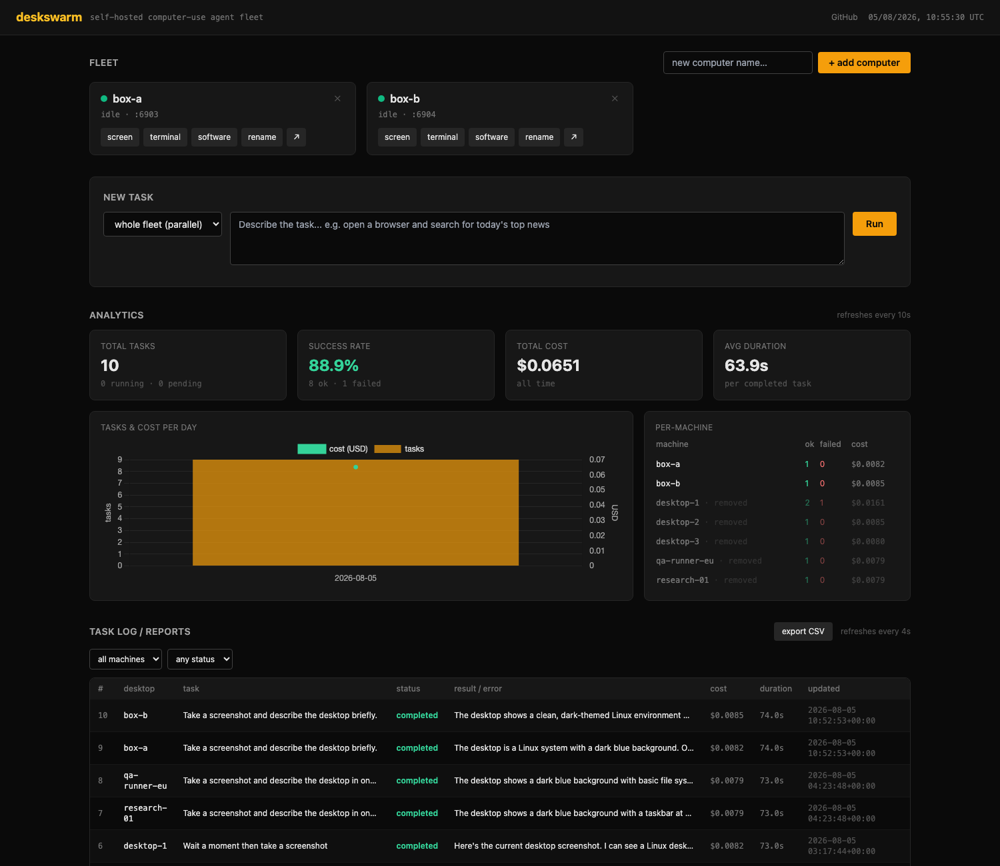
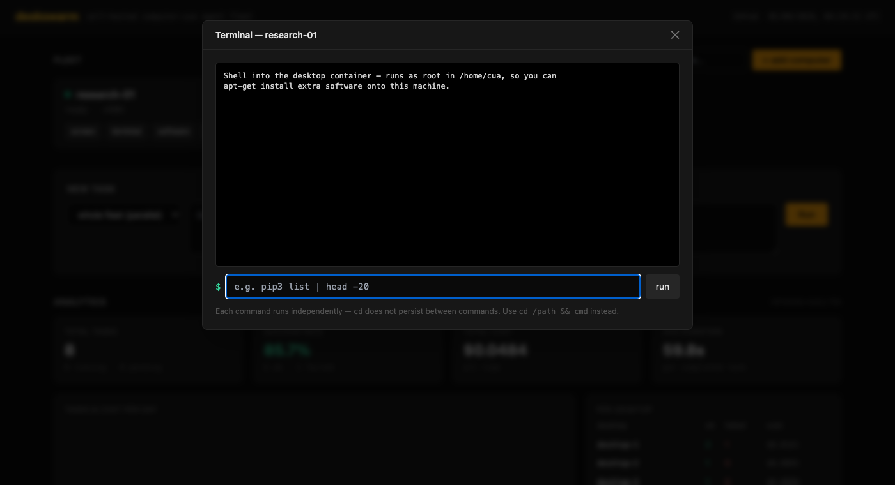
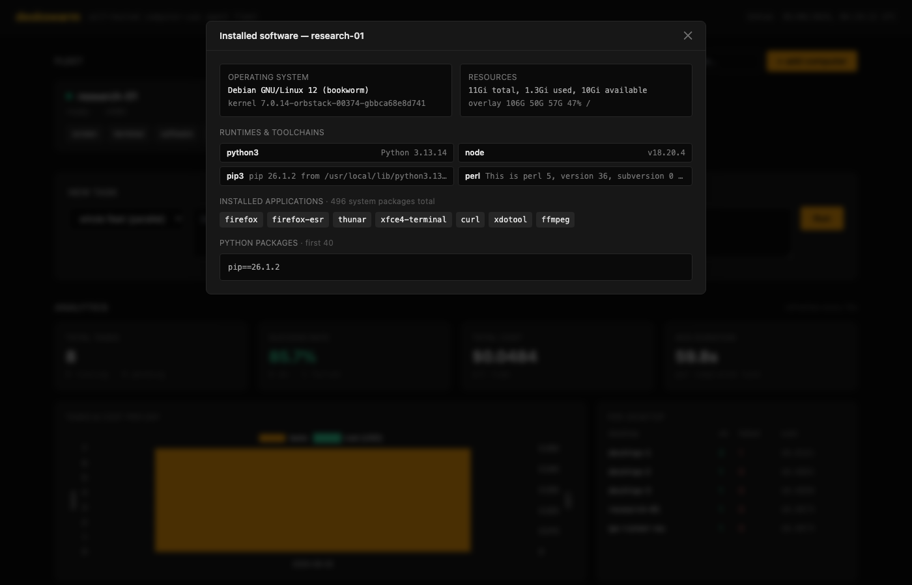
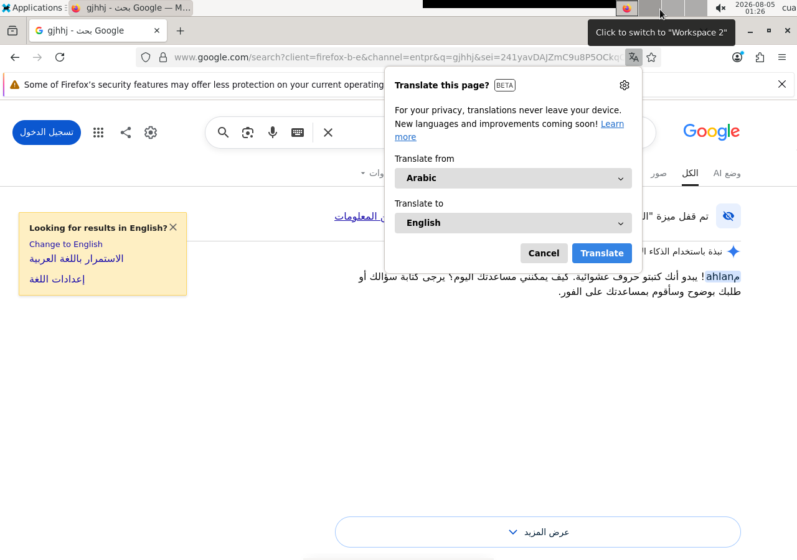

# deskswarm

[](LICENSE)
[](docker-compose.yml)
[](https://github.com/trycua/cua)
[](https://github.com/ahmedvnabil/deskswarm/actions/workflows/ci.yml)
[](https://github.com/trycua/cua/issues/2869)

**Self-hosted fleet of AI-controlled desktops, with a dashboard to dispatch
tasks and see what's happening.**

deskswarm spins up N full Linux desktops (real XFCE sessions, not headless
browsers) in Docker, wires each one up to an AI computer-use agent, and gives
you a single dashboard to send natural-language tasks to one desktop — or the
whole fleet in parallel — and watch the results, costs, and history.

Built on top of [cua](https://github.com/trycua/cua) (Apache-2.0), the
open-source computer-use SDK. deskswarm is the orchestration + fleet
management + dashboard layer on top.

<p align="center">
  
</p>

<p align="center">
  <sub>Every machine's screen, live. Amber = an agent is working (here it has opened a terminal and typed a command), red = the machine is down.</sub>
</p>

## Features

- **Manage the fleet from the UI** — add a computer by typing a name, and
  deskswarm creates its desktop + agent-bridge containers on the fly.
  Rename it, remove it, or grow to dozens of machines without touching
  `docker-compose.yml`. Each one is an independent machine with its own
  agent, its own screen, and its own installed software.
- **Add a batch at once** — `agent-{1..10}` in the name field creates ten
  machines in one go (zero-padding like `node-{01..10}` is preserved). Names
  that clash are reported individually; the rest still get created.
- **Snapshots** — provision one machine the way you like, hit **snapshot**,
  and every machine you create from it starts with that software already
  installed. No re-running setup on each new machine.
- **Per-machine terminal** — shell into any computer straight from the
  dashboard (runs as root), so you can `apt-get install` whatever that
  machine needs for its job.
- **Software inventory** — one click shows a machine's OS, kernel, runtimes
  (Python/Node/Go/…), installed apps, package count, and disk/RAM.
- **A wall of live screens** — the fleet is shown as its actual screens, not
  a list. You see what every agent is doing at a glance; a working machine is
  outlined amber with its current step and task, a broken one is red. Tiles
  poll a cached still (a live VNC stream per machine would not scale), and
  clicking one opens a real interactive session for that machine.
- **Filter, resize, and broadcast** — filter the wall by name or by
  busy/idle/down, switch tile size S/M/L, tick machines to aim a task at
  them, or leave nothing ticked to run on the whole fleet.
- **Control** — dispatch a task to one computer or the whole fleet in
  parallel; **cancel** a running task (kills the agent process cleanly);
  **retry** a failed one with one click.
- **Filter and page the task log** by machine and by status (in-flight /
  completed / failed / cancelled) — the log stays readable once the fleet
  grows and history piles up.
- **Schedules** — repeat a task every N minutes or daily at a set UTC time,
  on one machine or the whole fleet. Pause and resume from the table.
- **Live progress, not just a final answer** — while a task runs, the log
  shows the agent's *current step* (`screenshot`, `left_click`, `type_text`,
  ...), updated after every turn.
- **Live control** — click any tile for a full keyboard-and-mouse session on
  that machine. Each machine has its own VNC password and the dashboard
  connects for you (the password is in the machine's apps panel if you'd
  rather open noVNC directly).
- **Analytics & reports** — success rate, cost, average duration, a per-day
  chart, a per-machine breakdown, and CSV export. Click any row in the task
  log for the full report: every step the agent took, the untruncated result
  or error, duration and cost.
- **Recover a broken machine** — if its containers die or are removed outside
  the dashboard, the tile offers **restart**, which recreates the pair in
  place and keeps the machine's name, port and snapshot.

```
                      ┌───────────────────────────┐
  you ───────────────►│         dashboard         │
                      │  Flask · HTMX · SQLite    │
                      │  + Docker API (creates    │
                      │    and destroys machines) │
                      └────────────┬──────────────┘
                                   │
        ┌──────────────────────────┼──────────────────────────┐
        ▼                          ▼                          ▼
┌───────────────┐          ┌───────────────┐          ┌───────────────┐
│  computer A   │          │  computer B   │          │  computer C   │
│ ┌───────────┐ │          │ ┌───────────┐ │          │ ┌───────────┐ │
│ │  desktop  │ │          │ │  desktop  │ │          │ │  desktop  │ │
│ │ XFCE/VNC  │ │          │ │ XFCE/VNC  │ │          │ │ XFCE/VNC  │ │
│ └─────▲─────┘ │          │ └─────▲─────┘ │          │ └─────▲─────┘ │
│ ┌─────┴─────┐ │          │ ┌─────┴─────┐ │          │ ┌─────┴─────┐ │
│ │  bridge   │ │          │ │  bridge   │ │          │ │  bridge   │ │
│ │ REST↔VNC  │ │          │ │ REST↔VNC  │ │          │ │ REST↔VNC  │ │
│ └───────────┘ │          │ └───────────┘ │          │ └───────────┘ │
└───────────────┘          └───────────────┘          └───────────────┘
```

Every computer is a pair of containers created at runtime — there are no
desktops hard-coded in `docker-compose.yml`, which only runs the dashboard.

<p align="center">
  
  
</p>

<p align="center">
  <sub>Left: shell into any machine to provision it. Right: what's actually installed on it.</sub>
</p>

Each `desktop-N` is a full XFCE session — the agent doesn't just see a
browser viewport, it sees (and can click, type into, and screenshot) an
entire Linux desktop:

<p align="center">
  
</p>

<p align="center">
  <sub>What "watch live" actually shows — the agent driving a real Firefox session, not a scripted mock.</sub>
</p>

## Why

Most "AI browser agent" tools give the model a browser tab. deskswarm gives
it a **whole desktop** — any app, not just a browser — and lets you run
**several of them in parallel**, from one place, with a real task history
instead of a chat log you have to scroll through.

Good fits:
- Fanning the same task out across N desktops for throughput or comparison
- Anything that needs a real desktop app, not just a browser (file managers,
  PDF viewers, office tools, legacy GUI-only software)
- A cheap way to try computer-use agents without committing to a cloud
  provider's hosted sandbox

## Quickstart

Requires Docker and Docker Compose.

```bash
git clone https://github.com/ahmedvnabil/deskswarm.git
cd deskswarm
cp .env.example .env
# edit .env — at minimum set DESKSWARM_MODEL / DESKSWARM_API_KEY
docker compose up -d --build
```

Open `http://localhost:7861`. The fleet starts empty — type a name and hit
**+ add computer** to boot your first machine (the first one also builds the
bridge image, so give it a minute; later ones take about a second). Then send
it a task and watch its status go `pending → running (screenshot) → completed`
live.

## Configuring a model

deskswarm uses [cua](https://github.com/trycua/cua)'s Agent SDK, which is
built on LiteLLM — so `DESKSWARM_MODEL` accepts any LiteLLM model string.
`.env.example` documents four setups:

- **Anthropic API key** (recommended — most reliably tested path)
- **OpenAI API key**
- **Any OpenAI-compatible proxy** (LiteLLM proxy, internal gateway, etc.)
- **Local Ollama** (experimental, see below)

### Local models (experimental)

Running fully local is possible but not the default, because cua's generic
vision-model loop pulls in `qwen-agent` → `torch` (multi-GB) for tool-call
prompt formatting. If you want it:

```bash
# inside dashboard/Dockerfile, add:
RUN pip install --no-cache-dir "cua-agent[qwen]" torch
```

Then set `DESKSWARM_MODEL=ollama_chat/qwen3.5:9b` (or another
vision+tool-calling capable model) and `DESKSWARM_API_BASE` to your Ollama
host. Models without both vision and tool-calling support will fail or
silently misbehave — check `cua_agent/loops/model_types.csv` in the installed
package for what's natively supported.

## Scaling the fleet

Just add more computers from the UI — each gets its own containers and the
next free noVNC port automatically. Nothing to edit, nothing to restart. Use
an `agent-{1..10}` range to create a batch; `DESKSWARM_MAX_BULK_CREATE`
(default 25) caps one batch.

Sizing: each desktop is a full XFCE session, so budget roughly 0.5–1 GB RAM
per idle machine plus whatever its tasks need. `DESKSWARM_NOVNC_PORT_BASE`
sets where port allocation starts (default 6901).

If you open the dashboard from another device, set `DESKSWARM_PUBLIC_HOST`
to this host's LAN IP — it's what the embedded live screens are linked to.

## API

See [`docs/APIs.md`](docs/APIs.md) — computer CRUD (create, rename, delete,
**exec**, **inventory**), task CRUD (create, list, detail, **cancel**,
**retry**), live **analytics**, and **CSV export**, all under `/api/v1/*`
with optional bearer-token auth.

## Known issues

`cua-computer-server`'s VNC backend has two upstream bugs that will silently
break screenshots (agent reports a "black screen" that isn't real) if you're
integrating cua yourself outside this repo. deskswarm works around both —
full writeup in [`docs/UPSTREAM_CUA_BUG.md`](docs/UPSTREAM_CUA_BUG.md).

## Security

deskswarm gives an agent a real desktop and gives you a root shell on it from
a web page, so read [`SECURITY.md`](SECURITY.md) before exposing it. The short
version:

- **Set `DASHBOARD_TOKEN`** — without it every mutating endpoint is open to
  anyone who can reach the port.
- **Keep it off the public internet.** No TLS, no rate limiting.
- **The dashboard mounts the Docker socket**, which it needs in order to create
  machines. That is root on the host — treat the dashboard as a privileged
  admin surface, not an app you share a link to.
- Cross-site state-changing requests are rejected (this was an exploitable
  path to root command execution before it was fixed; see `SECURITY.md`).
- Don't put secrets in task descriptions — they are stored in history and sent
  to your model provider.

### Reproducibility

The desktop image is `trycua/xfce-cua:latest`, which upstream publishes only
as a moving tag, so two installs set up months apart may not get identical
machines. Pin `DESKSWARM_DESKTOP_IMAGE` to a digest if you need that
guarantee. Snapshots you take yourself are immutable and are the reliable way
to freeze a machine's exact software.

### Verified scale

Tested at **12 machines** on one 4-core / 8 GB host: the wall renders in ~25 ms
and a full round of screenshots takes ~0.5 s, comfortably inside the 6 s
refresh window. Budget roughly 200 MB of RAM per idle machine. Larger fleets
should be fine on the same reasoning but have not been measured.

## Contributing

See [`CONTRIBUTING.md`](CONTRIBUTING.md). `pytest tests -q` runs without
Docker, an agent, or a desktop.

## Architecture notes

- **desktop-N**: [`trycua/xfce-cua`](https://hub.docker.com/r/trycua/xfce-cua) — a real XFCE session over VNC/noVNC.
- **bridge-N**: `cua-computer-server` in VNC-backend mode, translating REST/WS calls into VNC input events + screenshots. See `bridge/`.
- **dashboard**: Flask + HTMX + Chart.js + SQLite (WAL mode). Mounts the Docker socket and creates/destroys the container pairs itself (`dashboard/fleet.py`); the fleet lives in the `computers` table, not in compose. Each task runs as an isolated subprocess (`dashboard/run_task.py`) using cua's `Computer` + `ComputerAgent` SDKs, so unrelated tasks never share agent state. The subprocess writes its `current_action` back to SQLite after every agent turn — that's what makes progress visible before the task finishes. Cancelling a task sends `SIGTERM` to that subprocess's PID.

## Credits

Built on [cua](https://github.com/trycua/cua) by the Cua team — deskswarm
wouldn't exist without their open-source computer-use SDK.

## License

MIT — see [`LICENSE`](LICENSE).
